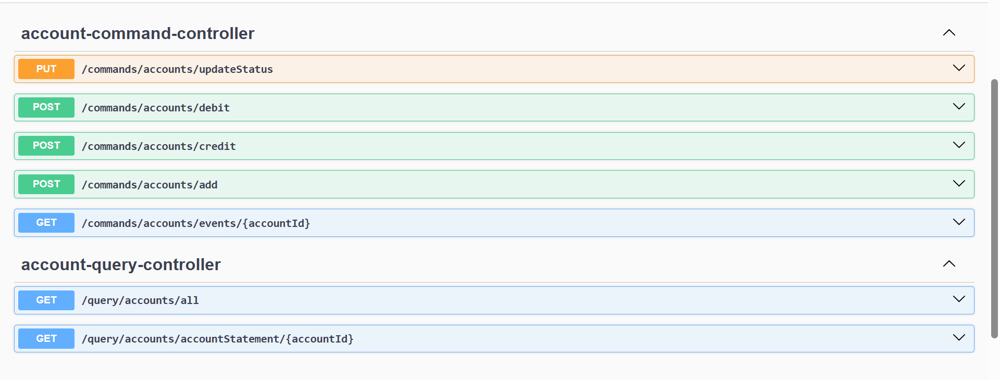

# Event sourcing and CQRS tutorial with spring boot and axon
This practical activity is made by professor Mohamed youssfi

## Objectives
- In this practical activity we will implement an event sourcing and CQRS architecture with spring boot and axon framework.

## 

### Dependencies
We will use the following dependencies:
- spring web
- lombok
- spring data jpa
- h2
- postgresql driver

we are adding also `axon` starter, and with exclusion of axon server connector, we told axon to not search for an external server and use the in memory which is provided by axon framework
```xml
<dependency>
    <groupId>org.axonframework</groupId>
    <artifactId>axon-spring-boot-starter</artifactId>
    <version>4.12.2</version>
    <exclusions>
        <exclusion>
            <groupId>org.axonframework</groupId>
            <artifactId>axon-server-connector</artifactId>
        </exclusion>
    </exclusions>
</dependency>
```

### In action
- First we add the rest controller `AccountCommandController` and the dto of the request `AddNewAccountRequestDto`
- Then we create the command class with the annotation `@TargetAggregateIdentifier` on the id
```java
@Getter @Setter @AllArgsConstructor
public class AddAccountCommand {
    @TargetAggregateIdentifier
    private String id;
    private double initialBalance;
    private String currency;
}
```
- After sending a post request to the controller we create the command
```java
@PostMapping("/add")
public CompletableFuture<Object> addNewAccount(@RequestBody AddNewAccountRequestDto request) {
    CompletableFuture<Object> response = commandGateway.send(new AddAccountCommand(
            UUID.randomUUID().toString(),
            request.initialBalance(),
            request.currency()
    ));
    return response;
}
```
- this command can't work without a command handler

## Aggregate
- We create the aggregate class that will hold command and event sourcing handlers with `@Aggregate` annotation and `@AggregateIdentifier`
```java
@Aggregate
public class AccountAggregate {
    @AggregateIdentifier
    private String accountId;
    private double currentBalance;
    private String currency;
    private AccountStatus status;
    ...
}
```
- The constructor of the aggregate will catch and handle the command
```java
@CommandHandler
public AccountAggregate(AddAccountCommand command) {
    log.info("CreateAccount Command Received");
    if (command.getInitialBalance()<0) throw  new IllegalArgumentException("Balance negative exception");
    AggregateLifecycle.apply(new AccountCreatedEvent(
            command.getId(),
            command.getInitialBalance(),
            command.getCurrency(),
            AccountStatus.CREATED
    ));
}
```
- And we create the method that catch the event (Event sourcing handler)
```java
@EventSourcingHandler
public void on(AccountCreatedEvent event){
    log.info("AccountCreatedEvent occurred");
    this.accountId =event.accountId();
    this.currentBalance = event.initialBalance();
    this.currency = event.currency();
    this.status = event.accountStatus();
}
```
- Now after executing we will find a few tables in database. when we inspect `domain_event_entry` we find serialized result. that's why we use the following properties
```properties
axon.serializer.events=jackson
axon.serializer.messages=xstream
axon.serializer.general=jackson 
```

- To inspect an aggregate
```java
@GetMapping("/events/{accountId}")
public Stream eventStore(@PathVariable String accountId){
    return eventStore.readEvents(accountId).asStream();
}
```


## Queries

- before we create query we create handlers for the events to project the events on our database and create the records.

## Apis


